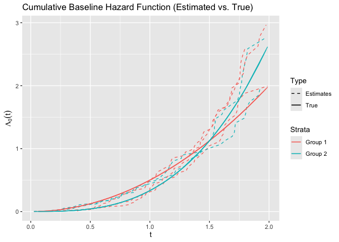

<!-- README.md is generated from README.Rmd. Please edit that file -->

# survtrans

<!-- badges: start -->

[](https://lifecycle.r-lib.org/articles/stages.html#experimental)
[](https://CRAN.R-project.org/package=survtrans)
[](https://github.com/ziyangg98/survtrans/actions/workflows/R-CMD-check.yaml)
[](https://app.codecov.io/gh/ziyangg98/survtrans)
<!-- badges: end -->

The goal of **survtrans** is to provide a framework for transferring
survival information from source domain(s) to a target domain. The
package currently supports the Cox proportional hazards model with both
global and local transfer learning.

## Installation

You can install the development version of **survtrans** with:

``` r
# install.packages("pak")
pak::pak("ziyangg98/survtrans")
```

## Example

This is a basic example showing how to transfer survival information
from multiple source domains to a target domain using the Cox
proportional hazards model:

``` r
library(survtrans)
library(ggplot2)

formula <- Surv(time, status) ~ . - group - id
fit <- coxtrans(
  formula, sim2, sim2$group, 1,
  lambda1 = 0.075, lambda2 = 0.04, lambda3 = 0.04, penalty = "SCAD"
)
summary(fit)
#> Call:
#> coxtrans(formula = formula, data = sim2, group = sim2$group,
#>     target = 1, lambda1 = 0.075, lambda2 = 0.04, lambda3 = 0.04,
#>     penalty = "SCAD")
#>
#>   n=500, number of events=422
#>
#>       coef exp(coef) se(coef)     z Pr(>|z|)
#> X1 0.33676   1.40040  0.05341 6.306 2.87e-10 ***
#> X2 0.35968   1.43287  0.05402 6.659 2.76e-11 ***
#> X3 0.34368   1.41012  0.05398 6.367 1.93e-10 ***
#> X4 0.32553   1.38476  0.05157 6.313 2.75e-10 ***
#> ---
#> Signif. codes:  0 '***' 0.001 '**' 0.01 '*' 0.05 '.' 0.1 ' ' 1
#>    exp(coef) exp(-coef) lower .95 upper .95
#> X1 1.4004    0.7141     1.2612    1.5549
#> X2 1.4329    0.6979     1.2889    1.5929
#> X3 1.4101    0.7092     1.2686    1.5675
#> X4 1.3848    0.7221     1.2516    1.5320
```

You can also plot the estimated cumulative baseline hazard function and
compare it to the true function:

``` r
basehaz_pred <- basehaz(fit)
basehaz_pred$color <- ifelse(
  as.numeric(basehaz_pred$strata) %% 2 == 0, "Group 2", "Group 1"
)
ggplot(
  basehaz_pred,
  aes(
    x = time,
    y = basehaz,
    group = strata,
    color = factor(color),
    linetype = "Estimates"
  )
) +
  geom_line() +
  geom_line(
    aes(x = time, y = time^2 / 2, color = "Group 1", linetype = "True")
  ) +
  geom_line(
    aes(x = time, y = time^3 / 3, color = "Group 2", linetype = "True")
  ) +
  labs(
    title = "Cumulative Baseline Hazard Function (Estimated vs. True)",
    x = expression(t),
    y = expression(Lambda[0](t))
  ) +
  scale_linetype_manual(values = c("Estimates" = "dashed", "True" = "solid")) +
  guides(
    color = guide_legend(title = "Strata"),
    linetype = guide_legend(title = "Type")
  )
```


