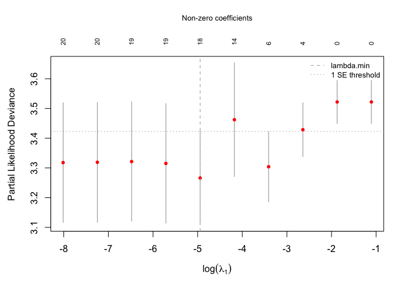
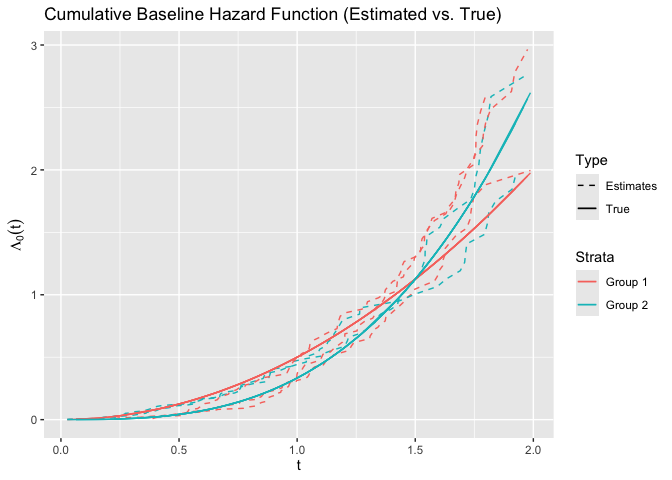

<!-- README.md is generated from README.Rmd. Please edit that file -->

# survtrans

<!-- badges: start -->

[](https://lifecycle.r-lib.org/articles/stages.html#experimental)
[](https://CRAN.R-project.org/package=survtrans)
[](https://github.com/ziyangg98/survtrans/actions/workflows/R-CMD-check.yaml)
[](https://app.codecov.io/gh/ziyangg98/survtrans)
<!-- badges: end -->

**survtrans** provides transfer learning for survival analysis using Cox
proportional hazards models. It transfers survival information from
source domain(s) to a target domain with three-layer penalization:

- **Sparse** (lambda1): variable selection on target coefficients
- **Local** (lambda2): shrinks source-target coefficient differences,
  encouraging shared effects
- **Prior transfer** (lambda3): incorporates prior knowledge about which
  source groups are informative via a customizable weight matrix

It also includes a symmetric multi-task variant, `coxmtl()`, which fits
all groups jointly without choosing a single target and uses
user-defined global centers.

## Installation

You can install the development version of **survtrans** with:

``` r
# install.packages("pak")
pak::pak("ziyangg98/survtrans")
```

## Example

Fit a transfer learning Cox model on simulated data with 5 groups (1
target + 4 sources, 20 features, true support on X1–X4):

``` r
library(survtrans)

formula <- Surv(time, status) ~ . - group - id
fit <- coxtrans(
  formula, sim2, sim2$group, 1,
  lambda1 = 0.075, lambda2 = 0.04, lambda3 = 0.04, penalty = "SCAD"
)
summary(fit)
#> Call:
#> coxtrans(formula = formula, data = sim2, group = sim2$group, 
#>     target = 1, lambda1 = 0.075, lambda2 = 0.04, lambda3 = 0.04, 
#>     penalty = "SCAD")
#> 
#>   n=500, number of events=422
#> 
#>       coef exp(coef) se(coef)     z Pr(>|z|)    
#> X1 0.35055   1.41985  0.05352 6.550 5.74e-11 ***
#> X2 0.35887   1.43171  0.05418 6.623 3.51e-11 ***
#> X3 0.34424   1.41091  0.05394 6.381 1.76e-10 ***
#> X4 0.32870   1.38916  0.05164 6.365 1.95e-10 ***
#> ---
#> Signif. codes:  0 '***' 0.001 '**' 0.01 '*' 0.05 '.' 0.1 ' ' 1
#>    exp(coef) exp(-coef) lower .95 upper .95
#> X1 1.4198    0.7043     1.2785    1.5769   
#> X2 1.4317    0.6985     1.2875    1.5921   
#> X3 1.4109    0.7088     1.2694    1.5683   
#> X4 1.3892    0.7199     1.2554    1.5371   
#> 
#> Feature structure:
#>   Prior transfer: X1, X2
#>   Shared (local): X3, X4
#>   Sparse (zero) : 16 features (X5, X6, X7, ...)
```

The model correctly identifies the three-layer structure: X1 and X2 are
transferred via the prior constraint, X3 and X4 are shared across all
groups via local shrinkage, and X5–X20 are sparse (zero).

### Symmetric multi-task fit

`coxmtl()` replaces the target/source decomposition with a fully
symmetric fit across all groups. The user supplies a matrix `w` whose
rows define global centers, and `lambda3` shrinks each group-specific
coefficient toward those centers.

``` r
w <- matrix(rep(1 / 5, 5), nrow = 1)
colnames(w) <- levels(factor(sim2$group))

fit_mtl <- coxmtl(
  formula, sim2, sim2$group, w,
  lambda1 = 0.03, lambda2 = 0.01, lambda3 = 0.01,
  penalty = "SCAD"
)
summary(fit_mtl)
#> Call:
#> coxmtl(formula = formula, data = sim2, group = sim2$group, w = w, 
#>     lambda1 = 0.03, lambda2 = 0.01, lambda3 = 0.01, penalty = "SCAD")
#> 
#>   n=500, number of events=422, df=6
#> 
#>          coef exp(coef) se(coef)      z Pr(>|z|)    
#> X1:1  0.34795   1.41617  0.05190  6.705 2.02e-11 ***
#> X2:1  0.36103   1.43481  0.05351  6.746 1.52e-11 ***
#> X3:1  0.34505   1.41206  0.05345  6.456 1.08e-10 ***
#> X4:1  0.32770   1.38777  0.05014  6.536 6.32e-11 ***
#> X1:2  0.94883   2.58268  0.08678 10.934  < 2e-16 ***
#> X2:2  0.96503   2.62487  0.08449 11.421  < 2e-16 ***
#> X3:2  0.34505   1.41206  0.05345  6.456 1.08e-10 ***
#> X4:2  0.32770   1.38777  0.05014  6.536 6.32e-11 ***
#> X1:3 -0.25292   0.77653  0.06953 -3.637 0.000275 ***
#> X2:3 -0.24297   0.78430  0.07961 -3.052 0.002272 ** 
#> X3:3  0.34505   1.41206  0.05345  6.456 1.08e-10 ***
#> X4:3  0.32770   1.38777  0.05014  6.536 6.32e-11 ***
#> X1:4  0.94883   2.58268  0.08678 10.934  < 2e-16 ***
#> X2:4  0.96503   2.62487  0.08449 11.421  < 2e-16 ***
#> X3:4  0.34505   1.41206  0.05345  6.456 1.08e-10 ***
#> X4:4  0.32770   1.38777  0.05014  6.536 6.32e-11 ***
#> X1:5 -0.25292   0.77653  0.06953 -3.637 0.000275 ***
#> X2:5 -0.24297   0.78430  0.07961 -3.052 0.002272 ** 
#> X3:5  0.34505   1.41206  0.05345  6.456 1.08e-10 ***
#> X4:5  0.32770   1.38777  0.05014  6.536 6.32e-11 ***
#> ---
#> Signif. codes:  0 '***' 0.001 '**' 0.01 '*' 0.05 '.' 0.1 ' ' 1
#>      exp(coef) exp(-coef) lower .95 upper .95
#> X1:1 1.4162    0.7061     1.2792    1.5678   
#> X2:1 1.4348    0.6970     1.2919    1.5935   
#> X3:1 1.4121    0.7082     1.2716    1.5680   
#> X4:1 1.3878    0.7206     1.2579    1.5311   
#> X1:2 2.5827    0.3872     2.1787    3.0615   
#> X2:2 2.6249    0.3810     2.2243    3.0976   
#> X3:2 1.4121    0.7082     1.2716    1.5680   
#> X4:2 1.3878    0.7206     1.2579    1.5311   
#> X1:3 0.7765    1.2878     0.6776    0.8899   
#> X2:3 0.7843    1.2750     0.6710    0.9167   
#> X3:3 1.4121    0.7082     1.2716    1.5680   
#> X4:3 1.3878    0.7206     1.2579    1.5311   
#> X1:4 2.5827    0.3872     2.1787    3.0615   
#> X2:4 2.6249    0.3810     2.2243    3.0976   
#> X3:4 1.4121    0.7082     1.2716    1.5680   
#> X4:4 1.3878    0.7206     1.2579    1.5311   
#> X1:5 0.7765    1.2878     0.6776    0.8899   
#> X2:5 0.7843    1.2750     0.6710    0.9167   
#> X3:5 1.4121    0.7082     1.2716    1.5680   
#> X4:5 1.3878    0.7206     1.2579    1.5311   
#> 
#> Global centers (w):
#>    1   2   3   4   5  
#> w1 0.2 0.2 0.2 0.2 0.2
```

### Custom prior matrix

When source groups have known structure (e.g., tissue type), you can
define a prior matrix to encode which sources are informative for the
target:

``` r
pm <- rbind(
  tissue_A = c(0.5, 0.5, 0, 0),
  tissue_B = c(0, 0, 0.5, 0.5)
)
colnames(pm) <- c("2", "3", "4", "5")

fit2 <- coxtrans(
  formula, sim2, sim2$group, 1,
  lambda1 = 0.075, lambda2 = 0.04, lambda3 = c(0.04, 0.04),
  prior_matrix = pm, penalty = "SCAD"
)
summary(fit2)
#> Call:
#> coxtrans(formula = formula, data = sim2, group = sim2$group, 
#>     target = 1, lambda1 = 0.075, lambda2 = 0.04, lambda3 = c(0.04, 
#>         0.04), prior_matrix = pm, penalty = "SCAD")
#> 
#>   n=500, number of events=422
#> 
#>       coef exp(coef) se(coef)     z Pr(>|z|)    
#> X1 0.34612   1.41357  0.06219 5.565 2.62e-08 ***
#> X2 0.35968   1.43287  0.06571 5.473 4.42e-08 ***
#> X3 0.34534   1.41247  0.05409 6.384 1.72e-10 ***
#> X4 0.32688   1.38663  0.05105 6.403 1.52e-10 ***
#> ---
#> Signif. codes:  0 '***' 0.001 '**' 0.01 '*' 0.05 '.' 0.1 ' ' 1
#>    exp(coef) exp(-coef) lower .95 upper .95
#> X1 1.4136    0.7074     1.2514    1.5968   
#> X2 1.4329    0.6979     1.2597    1.6298   
#> X3 1.4125    0.7080     1.2704    1.5705   
#> X4 1.3866    0.7212     1.2546    1.5326   
#> 
#> Feature structure:
#>   Prior [tissue_A,tissue_B]: X1, X2
#>   Shared (local)           : X3, X4
#>   Sparse (zero)            : 16 features (X5, X6, X7, ...)
```

### Automatic tuning

`cv.coxtrans()` selects all three penalty parameters jointly via K-fold
cross-validation over a full `lambda1 × lambda2 × lambda3` grid,
minimising the held-out partial likelihood deviance. It supports both
the **lambda.min** rule (minimum CV deviance) and the **lambda.1se**
rule (most sparse model within one standard error of the minimum,
consistent with **glmnet**). It returns a `cv.coxtrans` object with CV
diagnostics and the final refitted models at both rules.

``` r
cv_fit <- cv.coxtrans(
  formula, sim2, sim2$group,
  target = 1, penalty = "SCAD", ncores = 8
)
cv_fit
#> cv.coxtrans
#> 
#> Call: cv.coxtrans(formula = formula, data = sim2, group = sim2$group, 
#>     target = 1, penalty = "SCAD", ncores = 8)
#> 
#> Measure: Partial Likelihood Deviance
#> 
#> lambda.min:  l1=0.0071  l2=0.0120  l3=0.0215
#>   Deviance:  3.2660 (+/- 0.1572)   Non-zero: 18
#> 
#> lambda.1se:  l1=0.0713  l2=0.0259  l3=2e-04
#>   Deviance:  3.4043 (+/- 0.1401)   Non-zero: 4
```

The CV curve along the `lambda1` axis (with `lambda2` and `lambda3`
fixed at their optimal values) can be visualised with `plot()`:

``` r
plot(cv_fit)
```



Access the final fitted model via `$coxtrans.fit` (lambda.min) or
`$coxtrans.fit.1se` (lambda.1se). Use `coef(cv_fit, s = "lambda.1se")`
or `predict(cv_fit, s = "lambda.1se", ...)` to extract from the sparser
model.

``` r
summary(cv_fit$coxtrans.fit)
#> Call:
#> coxtrans(formula = formula, data = data, group = group, target = target, 
#>     lambda1 = lam$lambda1, lambda2 = lam$lambda2, lambda3 = lam$lambda3, 
#>     prior_matrix = prior_matrix, penalty = penalty, control = control)
#> 
#>   n=500, number of events=422
#> 
#>          coef exp(coef)  se(coef)      z Pr(>|z|)    
#> X1   0.376677  1.457434  0.066869  5.633 1.77e-08 ***
#> X2   0.414787  1.514049  0.067305  6.163 7.15e-10 ***
#> X3   0.329046  1.389641  0.075007  4.387 1.15e-05 ***
#> X4   0.367069  1.443497  0.082051  4.474 7.69e-06 ***
#> X5  -0.042886  0.958020  0.062711 -0.684  0.49406    
#> X6   0.006053  1.006071  0.056720  0.107  0.91502    
#> X7   0.185231  1.203497  0.065631  2.822  0.00477 ** 
#> X8   0.054851  1.056383  0.072063  0.761  0.44657    
#> X9   0.059147  1.060931  0.065391  0.905  0.36572    
#> X10 -0.318969  0.726898  0.109410 -2.915  0.00355 ** 
#> X12 -0.254036  0.775664  0.108472 -2.342  0.01918 *  
#> X13 -0.156053  0.855514  0.096408 -1.619  0.10552    
#> X14  0.063882  1.065966  0.080142  0.797  0.42539    
#> X15  0.053287  1.054732  0.059468  0.896  0.37022    
#> X16 -0.060031  0.941735  0.060498 -0.992  0.32106    
#> X17  0.025616  1.025947  0.060715  0.422  0.67310    
#> X19  0.051585  1.052939  0.072417  0.712  0.47626    
#> X20 -0.085512  0.918042  0.062834 -1.361  0.17354    
#> ---
#> Signif. codes:  0 '***' 0.001 '**' 0.01 '*' 0.05 '.' 0.1 ' ' 1
#>     exp(coef) exp(-coef) lower .95 upper .95
#> X1  1.4574    0.6861     1.2784    1.6615   
#> X2  1.5140    0.6605     1.3269    1.7275   
#> X3  1.3896    0.7196     1.1997    1.6097   
#> X4  1.4435    0.6928     1.2291    1.6953   
#> X5  0.9580    1.0438     0.8472    1.0833   
#> X6  1.0061    0.9940     0.9002    1.1244   
#> X7  1.2035    0.8309     1.0582    1.3687   
#> X8  1.0564    0.9466     0.9172    1.2166   
#> X9  1.0609    0.9426     0.9333    1.2060   
#> X10 0.7269    1.3757     0.5866    0.9007   
#> X12 0.7757    1.2892     0.6271    0.9594   
#> X13 0.8555    1.1689     0.7082    1.0335   
#> X14 1.0660    0.9381     0.9110    1.2473   
#> X15 1.0547    0.9481     0.9387    1.1851   
#> X16 0.9417    1.0619     0.8364    1.0603   
#> X17 1.0259    0.9747     0.9108    1.1556   
#> X19 1.0529    0.9497     0.9136    1.2135   
#> X20 0.9180    1.0893     0.8117    1.0384   
#> 
#> Feature structure:
#>   Prior transfer: X1, X2
#>   Shared (local): X6, X15
#>   Partial shared: X3, X4, X5, X7, X8, X9, X11, X13, X14, X16, X17, X18, X19, X20
#>   Group-specific: X10, X12
```

### Baseline hazard

``` r
library(ggplot2)

basehaz_pred <- basehaz(fit)
basehaz_pred$color <- ifelse(
  as.numeric(basehaz_pred$strata) %% 2 == 0, "Group 2", "Group 1"
)
ggplot(
  basehaz_pred,
  aes(
    x = time,
    y = basehaz,
    group = strata,
    color = factor(color),
    linetype = "Estimates"
  )
) +
  geom_line() +
  geom_line(
    aes(x = time, y = time^2 / 2, color = "Group 1", linetype = "True")
  ) +
  geom_line(
    aes(x = time, y = time^3 / 3, color = "Group 2", linetype = "True")
  ) +
  labs(
    title = "Cumulative Baseline Hazard Function (Estimated vs. True)",
    x = expression(t),
    y = expression(Lambda[0](t))
  ) +
  scale_linetype_manual(values = c("Estimates" = "dashed", "True" = "solid")) +
  guides(
    color = guide_legend(title = "Strata"),
    linetype = guide_legend(title = "Type")
  )
```


